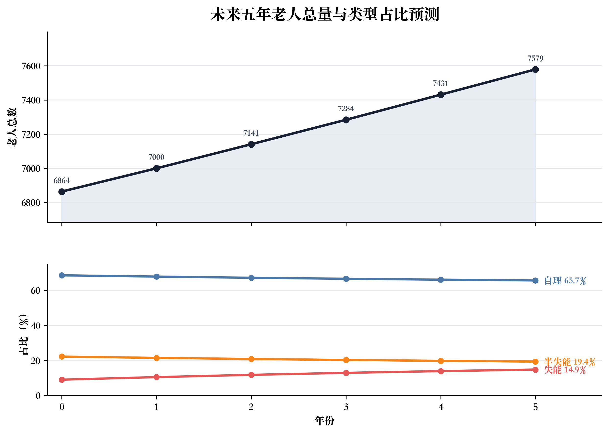
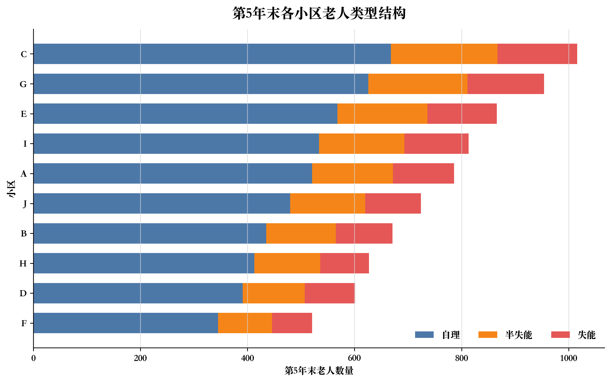
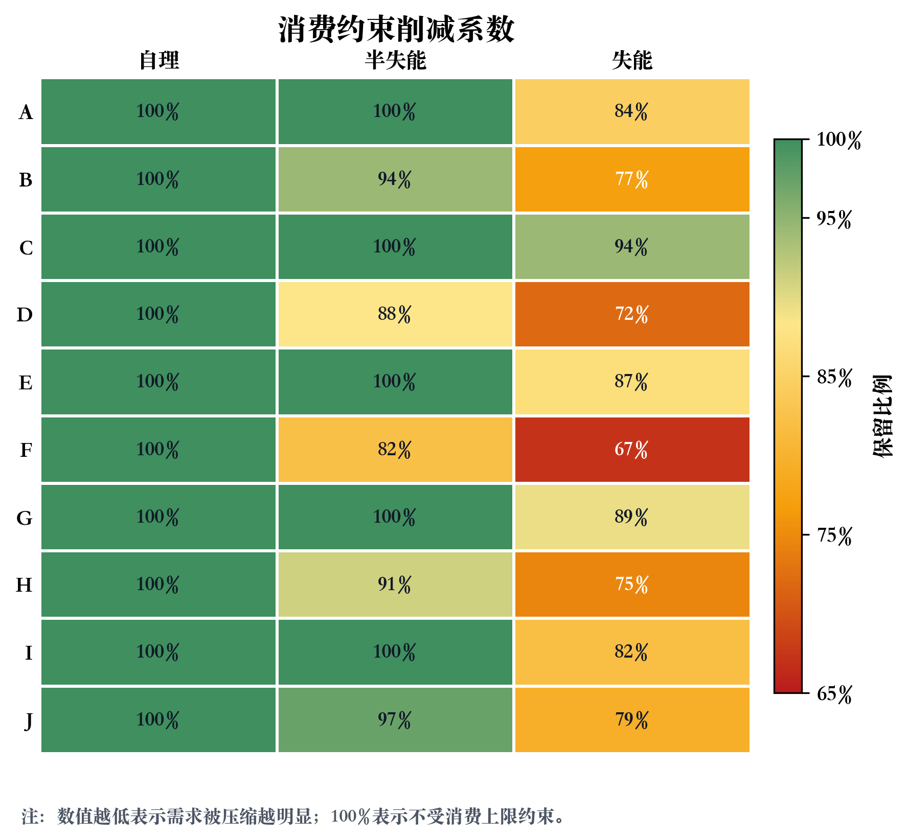
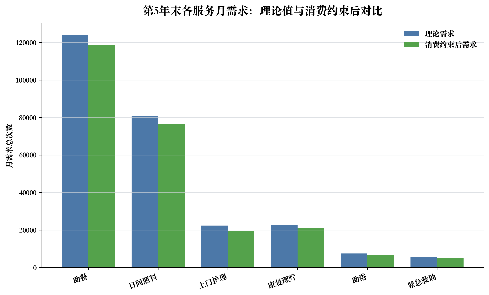

# 第一问：未来五年老人数量与服务需求量预测

## 摘要

针对 B 题第一问，本文建立三状态老人数量递推模型，将老人状态划分为自理、半失能、失能三类，并结合自然死亡率、新增老年人口比例与状态转移概率，预测未来五年各小区各类老人数量。在此基础上，利用服务需求矩阵计算第5年末六类养老服务的理论月需求，再引入人均收入与月消费上限约束，对服务需求进行等比例削减，得到第5年末各小区各类型老人的可支付月均服务需求。所有结果由 `src/solve_question1.py` 自动生成，图表输出在 `img/`，附表输出在 `docs/tables/`。

## 1 数据来源与符号约定

第一问主要使用附件1和附件2。

| 数据表 | 主要字段 | 模型符号 | 用途 |
|---|---|---|---|
| 附件1-人口与老人结构 | 小区编号、总人口、60+老人数、自理老人、半失能老人、失能老人、人均月收入 | \(N_{i,0}^a,N_{i,0}^h,N_{i,0}^d,M_i\) | 初始人口状态与消费约束 |
| 附件1-转移概率 | 自理到半失能、半失能到失能 | \(\rho_{ah},\rho_{hd}\) | 状态转移参数 |
| 附件2-每位老人月均服务需求次数 | 服务项目、自理、半自理、失能 | \(q_{s,t}^0\) | 理论月需求频次 |
| 附件2-服务营收及支出 | 单次服务营收、单次服务直接支出 | \(p_s^0,c_s\) | 理论服务费用与后续成本口径 |
| 附件2-月服务消费上限 | 老人类型、收入占比 | \(\alpha_t\) | 消费能力约束 |

设小区集合为
\[
I=\{A,B,C,D,E,F,G,H,I,J\},
\]
老人类型集合为
\[
T=\{a,h,d\},
\]
其中 \(a,h,d\) 分别表示自理、半失能、失能。服务集合为
\[
S=\{\text{助餐},\text{日间照料},\text{上门护理},\text{康复理疗},\text{助浴},\text{紧急救助}\}.
\]

基准参数取值为：自然死亡率 \(\mu=5\%\)，新增老人比例 \(\eta=7\%\)，自理转半失能概率 \(\rho_{ah}=0.045\)，半失能转失能概率 \(\rho_{hd}=0.10\)。

## 2 问题1.1：老人数量递推预测模型

### 2.1 模型假设

1. 新增刚满60岁老人默认进入自理老人状态；
2. 自理老人可能转为半失能，半失能老人可能转为失能，失能老人不恢复；
3. 自然死亡率对三类老人均适用；
4. 五年内人口结构、收入水平、服务需求频次等参数保持稳定；
5. 每年末人数采用最大余数法整数化，以保持各类型人数之和与总人数一致。

### 2.2 递推模型

记小区 \(i\) 在第 \(y\) 年末的老人状态向量为
\[
\boldsymbol{N}_{i,y}=
\begin{bmatrix}
N_{i,y}^a\\
N_{i,y}^h\\
N_{i,y}^d
\end{bmatrix},
\qquad
N_{i,y}=N_{i,y}^a+N_{i,y}^h+N_{i,y}^d.
\]

逐年递推为
\[
\begin{aligned}
\widetilde N_{i,y+1}^a
&=(1-\mu)(1-\rho_{ah})N_{i,y}^a+\eta N_{i,y},\\
\widetilde N_{i,y+1}^h
&=(1-\mu)\rho_{ah}N_{i,y}^a+(1-\mu)(1-\rho_{hd})N_{i,y}^h,\\
\widetilde N_{i,y+1}^d
&=(1-\mu)\rho_{hd}N_{i,y}^h+(1-\mu)N_{i,y}^d.
\end{aligned}
\]

写成矩阵形式：
\[
\boldsymbol{N}_{i,y+1}
=
\boldsymbol{A}\boldsymbol{N}_{i,y}
+\eta N_{i,y}\boldsymbol{e}_a,
\qquad
\boldsymbol{e}_a=(1,0,0)^\top,
\]
其中
\[
\boldsymbol{A}=(1-\mu)
\begin{bmatrix}
1-\rho_{ah} & 0 & 0\\
\rho_{ah} & 1-\rho_{hd} & 0\\
0 & \rho_{hd} & 1
\end{bmatrix}.
\]

注意，健康状态转移只改变老人类型，不改变老人总量。因此对三类老人求和可得
\[
N_{i,y+1}\approx(1-\mu)N_{i,y}+\eta N_{i,y}
=(1+\eta-\mu)N_{i,y}=1.02N_{i,y}.
\]
也就是说，在本题基准参数下老人总数是年增长率约 \(2\%\) 的几何增长；由于预测期只有5年且增长率较小，折线图在视觉上会接近线性，但数学上并非线性递推。

### 2.3 预测结果

全街道老人总量和结构的五年预测如下。

| 年份 | 自理 | 半失能 | 失能 | 老人总数 |
| --- | --- | --- | --- | --- |
| 0 | 4712 | 1528 | 624 | 6864 |
| 1 | 4755 | 1507 | 738 | 7000 |
| 2 | 4802 | 1493 | 846 | 7141 |
| 3 | 4857 | 1481 | 946 | 7284 |
| 4 | 4917 | 1475 | 1039 | 7431 |
| 5 | 4981 | 1472 | 1126 | 7579 |

第5年末各小区老人数量预测如下。

| 小区 | 自理 | 半失能 | 失能 | 老人总数 |
| --- | --- | --- | --- | --- |
| A | 521 | 151 | 114 | 786 |
| B | 435 | 130 | 106 | 671 |
| C | 668 | 199 | 149 | 1016 |
| D | 391 | 116 | 94 | 601 |
| E | 568 | 168 | 130 | 866 |
| F | 345 | 101 | 75 | 521 |
| G | 626 | 185 | 143 | 954 |
| H | 413 | 123 | 91 | 627 |
| I | 534 | 159 | 120 | 813 |
| J | 480 | 140 | 104 | 724 |

## 3 问题1.2：第5年末理论月服务需求预测

### 3.1 模型表达

设 \(q_{s,t}^0\) 为类型 \(t\) 老人对服务 \(s\) 的理论月均需求次数。第5年末，小区 \(i\)、类型 \(t\)、服务 \(s\) 的理论月需求为
\[
Q_{i,s,t,5}^0=N_{i,5}^t q_{s,t}^0.
\]
小区 \(i\) 对服务 \(s\) 的理论月需求总量为
\[
Q_{i,s,5}^0=\sum_{t\in T}Q_{i,s,t,5}^0.
\]

### 3.2 计算结果

按服务项目和老人类型汇总的全街道理论月需求如下。

| 服务项目 | 自理 | 半失能 | 失能 | 合计 |
| --- | --- | --- | --- | --- |
| 助餐 | 69734 | 29440 | 24772 | 123946 |
| 日间照料 | 39848 | 20608 | 20268 | 80724 |
| 上门护理 | 0 | 8832 | 13512 | 22344 |
| 康复理疗 | 9962 | 5888 | 6756 | 22606 |
| 助浴 | 0 | 2944 | 4504 | 7448 |
| 紧急救助 | 747 | 1472 | 3378 | 5597 |

按小区和服务项目汇总的第5年末理论月需求如下。

| 小区 | 助餐 | 日间照料 | 上门护理 | 康复理疗 | 助浴 | 紧急救助 |
| --- | --- | --- | --- | --- | --- | --- |
| A | 12822 | 8334 | 2274 | 2330 | 758 | 571 |
| B | 11022 | 7208 | 2052 | 2026 | 684 | 513 |
| C | 16610 | 10812 | 2982 | 3026 | 994 | 746 |
| D | 9862 | 6444 | 1824 | 1810 | 608 | 457 |
| E | 14172 | 9236 | 2568 | 2588 | 856 | 643 |
| F | 8500 | 5524 | 1506 | 1544 | 502 | 378 |
| G | 15610 | 10172 | 2826 | 2850 | 942 | 708 |
| H | 10244 | 6664 | 1830 | 1864 | 610 | 458 |
| I | 13296 | 8658 | 2394 | 2424 | 798 | 599 |
| J | 11808 | 7672 | 2088 | 2144 | 696 | 524 |

按“小区-老人类型-服务项目”展开的明细表较长，已完整导出为 `docs/tables/q1_theoretical_demand_detail.csv`。下表给出明细前若干行用于核验口径。

| 小区 | 老人类型 | 助餐 | 日间照料 | 上门护理 | 康复理疗 | 助浴 | 紧急救助 |
| --- | --- | --- | --- | --- | --- | --- | --- |
| A | 半失能 | 3020 | 2114 | 906 | 604 | 302 | 151 |
| A | 失能 | 2508 | 2052 | 1368 | 684 | 456 | 342 |
| A | 自理 | 7294 | 4168 | 0 | 1042 | 0 | 78 |
| B | 半失能 | 2600 | 1820 | 780 | 520 | 260 | 130 |
| B | 失能 | 2332 | 1908 | 1272 | 636 | 424 | 318 |
| B | 自理 | 6090 | 3480 | 0 | 870 | 0 | 65 |
| C | 半失能 | 3980 | 2786 | 1194 | 796 | 398 | 199 |
| C | 失能 | 3278 | 2682 | 1788 | 894 | 596 | 447 |
| C | 自理 | 9352 | 5344 | 0 | 1336 | 0 | 100 |
| D | 半失能 | 2320 | 1624 | 696 | 464 | 232 | 116 |
| D | 失能 | 2068 | 1692 | 1128 | 564 | 376 | 282 |
| D | 自理 | 5474 | 3128 | 0 | 782 | 0 | 59 |

## 4 问题1.3：消费约束下的月均服务需求

### 4.1 消费约束模型

设小区 \(i\) 人均月收入为 \(M_i\)，类型 \(t\) 老人的月服务消费上限比例为 \(\alpha_t\)。理论月服务费用为
\[
E_{i,t}^0=\sum_{s\in S}p_s^0q_{s,t}^0,
\]
月消费上限为
\[
L_{i,t}=\alpha_tM_i.
\]
若 \(E_{i,t}^0>L_{i,t}\)，则按附件说明对各服务次数等比例削减。定义削减系数
\[
\lambda_{i,t}=\min\left\{1,\frac{L_{i,t}}{E_{i,t}^0}\right\}.
\]
于是消费约束后的单个老人月均服务需求为
\[
\bar q_{i,s,t}=\lambda_{i,t}q_{s,t}^0,
\]
对应小区总需求为
\[
Q_{i,s,t,5}=N_{i,5}^t\bar q_{i,s,t}.
\]

由于原始需求表中紧急救助为 0.15 次/月等小数频次，本文在人均需求表中保留两位小数；在小区月需求总次数表中进行四舍五入取整。

### 4.2 消费约束强度

各小区、各类型老人的消费削减系数如下。系数为1表示消费能力不构成约束，系数小于1表示需要同比例压缩服务次数。

| 小区 | 老人类型 | 人均月收入 | 理论月费用 | 消费上限 | 削减系数 | 预算是否约束 |
| --- | --- | --- | --- | --- | --- | --- |
| A | 自理 | 3400 | 356 | 680 | 1 | 否 |
| A | 半失能 | 3400 | 822 | 850 | 1 | 否 |
| A | 失能 | 3400 | 1208 | 1020 | 0.84 | 是 |
| B | 自理 | 3100 | 356 | 620 | 1 | 否 |
| B | 半失能 | 3100 | 822 | 775 | 0.94 | 是 |
| B | 失能 | 3100 | 1208 | 930 | 0.77 | 是 |
| C | 自理 | 3800 | 356 | 760 | 1 | 否 |
| C | 半失能 | 3800 | 822 | 950 | 1 | 否 |
| C | 失能 | 3800 | 1208 | 1140 | 0.94 | 是 |
| D | 自理 | 2900 | 356 | 580 | 1 | 否 |
| D | 半失能 | 2900 | 822 | 725 | 0.88 | 是 |
| D | 失能 | 2900 | 1208 | 870 | 0.72 | 是 |
| E | 自理 | 3500 | 356 | 700 | 1 | 否 |
| E | 半失能 | 3500 | 822 | 875 | 1 | 否 |
| E | 失能 | 3500 | 1208 | 1050 | 0.87 | 是 |
| F | 自理 | 2700 | 356 | 540 | 1 | 否 |
| F | 半失能 | 2700 | 822 | 675 | 0.82 | 是 |
| F | 失能 | 2700 | 1208 | 810 | 0.67 | 是 |
| G | 自理 | 3600 | 356 | 720 | 1 | 否 |
| G | 半失能 | 3600 | 822 | 900 | 1 | 否 |
| G | 失能 | 3600 | 1208 | 1080 | 0.89 | 是 |
| H | 自理 | 3000 | 356 | 600 | 1 | 否 |
| H | 半失能 | 3000 | 822 | 750 | 0.91 | 是 |
| H | 失能 | 3000 | 1208 | 900 | 0.74 | 是 |
| I | 自理 | 3300 | 356 | 660 | 1 | 否 |
| I | 半失能 | 3300 | 822 | 825 | 1 | 否 |
| I | 失能 | 3300 | 1208 | 990 | 0.82 | 是 |
| J | 自理 | 3200 | 356 | 640 | 1 | 否 |
| J | 半失能 | 3200 | 822 | 800 | 0.97 | 是 |
| J | 失能 | 3200 | 1208 | 960 | 0.79 | 是 |

### 4.3 消费约束后的需求结果

按服务项目和老人类型汇总的全街道消费约束后月需求如下。

| 服务项目 | 自理 | 半失能 | 失能 | 合计 |
| --- | --- | --- | --- | --- |
| 助餐 | 69734 | 28366 | 20374 | 118474 |
| 日间照料 | 39848 | 19856 | 16670 | 76374 |
| 上门护理 | 0 | 8510 | 11112 | 19622 |
| 康复理疗 | 9962 | 5673 | 5558 | 21193 |
| 助浴 | 0 | 2837 | 3703 | 6540 |
| 紧急救助 | 747 | 1418 | 2779 | 4944 |

按小区和服务项目汇总的消费约束后月需求如下。

| 小区 | 助餐 | 日间照料 | 上门护理 | 康复理疗 | 助浴 | 紧急救助 |
| --- | --- | --- | --- | --- | --- | --- |
| A | 12432 | 8015 | 2061 | 2224 | 687 | 518 |
| B | 10336 | 6665 | 1714 | 1850 | 571 | 433 |
| C | 16425 | 10661 | 2881 | 2976 | 960 | 721 |
| D | 9009 | 5779 | 1426 | 1597 | 476 | 364 |
| E | 13798 | 8930 | 2364 | 2486 | 788 | 592 |
| F | 7595 | 4826 | 1101 | 1324 | 367 | 286 |
| G | 15277 | 9899 | 2644 | 2759 | 881 | 663 |
| H | 9519 | 6095 | 1487 | 1682 | 495 | 377 |
| I | 12820 | 8268 | 2134 | 2294 | 711 | 534 |
| J | 11263 | 7236 | 1810 | 2001 | 604 | 456 |

第5年末每个小区、各类型老人的消费约束后人均月服务需求如下。

| 小区 | 老人类型 | 助餐 | 日间照料 | 上门护理 | 康复理疗 | 助浴 | 紧急救助 |
| --- | --- | --- | --- | --- | --- | --- | --- |
| A | 半失能 | 20 | 14 | 6 | 4 | 2 | 1 |
| A | 失能 | 18.58 | 15.20 | 10.13 | 5.07 | 3.38 | 2.53 |
| A | 自理 | 14 | 8 | 0 | 2 | 0 | 0.15 |
| B | 半失能 | 18.86 | 13.20 | 5.66 | 3.77 | 1.89 | 0.94 |
| B | 失能 | 16.94 | 13.86 | 9.24 | 4.62 | 3.08 | 2.31 |
| B | 自理 | 14 | 8 | 0 | 2 | 0 | 0.15 |
| C | 半失能 | 20 | 14 | 6 | 4 | 2 | 1 |
| C | 失能 | 20.76 | 16.99 | 11.32 | 5.66 | 3.77 | 2.83 |
| C | 自理 | 14 | 8 | 0 | 2 | 0 | 0.15 |
| D | 半失能 | 17.64 | 12.35 | 5.29 | 3.53 | 1.76 | 0.88 |
| D | 失能 | 15.84 | 12.96 | 8.64 | 4.32 | 2.88 | 2.16 |
| D | 自理 | 14 | 8 | 0 | 2 | 0 | 0.15 |
| E | 半失能 | 20 | 14 | 6 | 4 | 2 | 1 |
| E | 失能 | 19.12 | 15.65 | 10.43 | 5.22 | 3.48 | 2.61 |
| E | 自理 | 14 | 8 | 0 | 2 | 0 | 0.15 |
| F | 半失能 | 16.42 | 11.50 | 4.93 | 3.28 | 1.64 | 0.82 |
| F | 失能 | 14.75 | 12.07 | 8.05 | 4.02 | 2.68 | 2.01 |
| F | 自理 | 14 | 8 | 0 | 2 | 0 | 0.15 |
| G | 半失能 | 20 | 14 | 6 | 4 | 2 | 1 |
| G | 失能 | 19.67 | 16.09 | 10.73 | 5.36 | 3.58 | 2.68 |
| G | 自理 | 14 | 8 | 0 | 2 | 0 | 0.15 |
| H | 半失能 | 18.25 | 12.77 | 5.47 | 3.65 | 1.82 | 0.91 |
| H | 失能 | 16.39 | 13.41 | 8.94 | 4.47 | 2.98 | 2.24 |
| H | 自理 | 14 | 8 | 0 | 2 | 0 | 0.15 |
| I | 半失能 | 20 | 14 | 6 | 4 | 2 | 1 |
| I | 失能 | 18.03 | 14.75 | 9.83 | 4.92 | 3.28 | 2.46 |
| I | 自理 | 14 | 8 | 0 | 2 | 0 | 0.15 |
| J | 半失能 | 19.46 | 13.63 | 5.84 | 3.89 | 1.95 | 0.97 |
| J | 失能 | 17.48 | 14.30 | 9.54 | 4.77 | 3.18 | 2.38 |
| J | 自理 | 14 | 8 | 0 | 2 | 0 | 0.15 |

## 5 算法步骤与复杂度

第一问采用确定性递推和矩阵乘法计算，步骤如下：

1. 读取附件1中的小区老人初始结构、收入和状态转移概率；
2. 对每个小区建立三状态向量 \(\boldsymbol{N}_{i,y}\)；
3. 按年度状态递推式计算 \(y=1,\dots,5\) 的老人数量，并用最大余数法整数化；
4. 读取附件2中的服务需求矩阵，计算第5年末理论需求 \(Q_{i,s,t,5}^0\)；
5. 根据收入和消费上限计算削减系数 \(\lambda_{i,t}\)，得到消费约束后的需求；
6. 导出结果表和学术图。

若小区数为 \(|I|\)，老人类型数为 \(|T|\)，服务项目数为 \(|S|\)，预测年数为 \(Y\)，则人口递推复杂度为
\[
O(|I|Y|T|^2),
\]
需求计算复杂度为
\[
O(|I||T||S|).
\]
本题中 \(|I|=10, |T|=3, |S|=6, Y=5\)，计算规模很小，算法可精确、稳定复现。

## 6 结论

在基准参数下，街道 60 岁以上老人总量从当前 6864 人增长到第5年末 7579 人，其中自理老人 4981 人、半失能老人 1472 人、失能老人 1126 人。消费约束主要影响半失能和失能老人，尤其失能老人由于护理、日间照料、康复理疗和助浴需求较高，理论费用普遍超过收入上限，因此需要明显压缩需求。消费约束后，助餐和日间照料仍是总需求最高的两类服务；上门护理、康复理疗、助浴等服务的需求对收入约束更敏感，应在后续站点选址和补贴定价模型中重点考虑。
