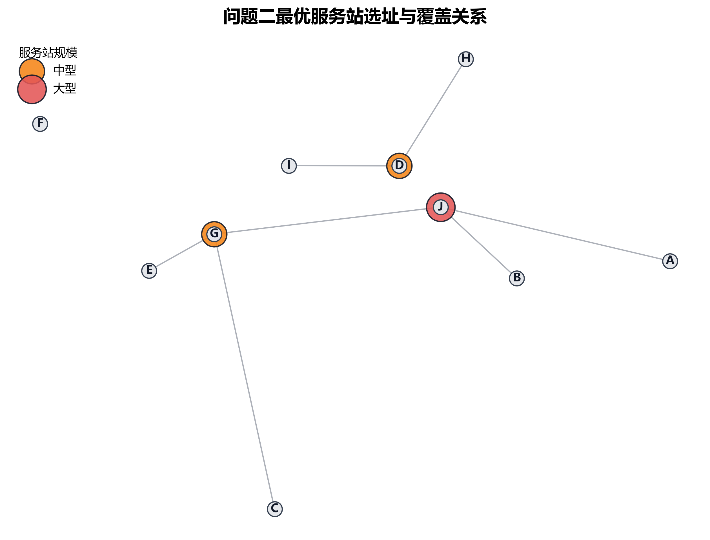
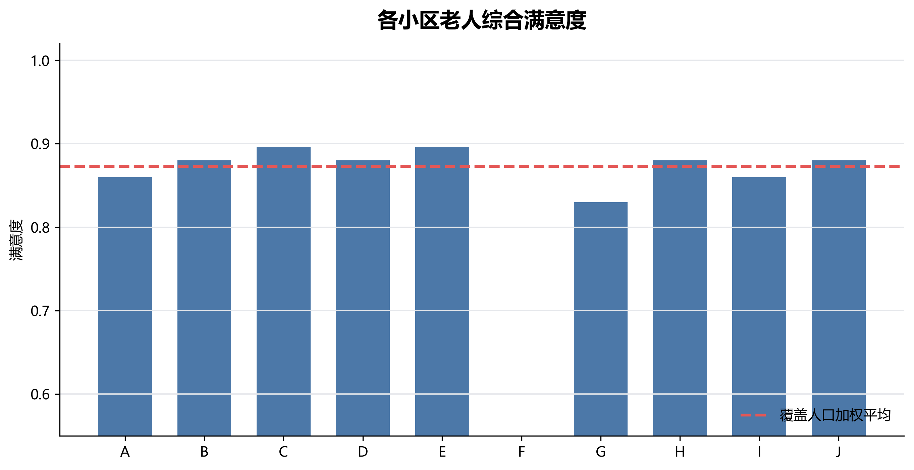
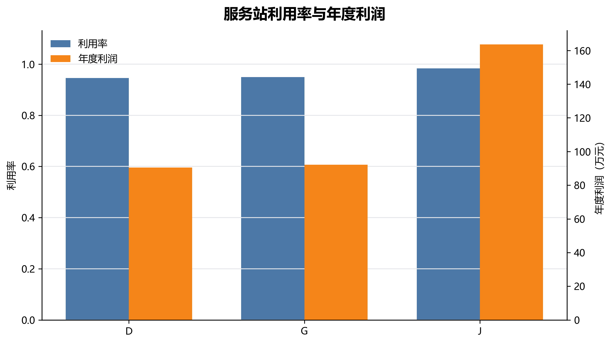
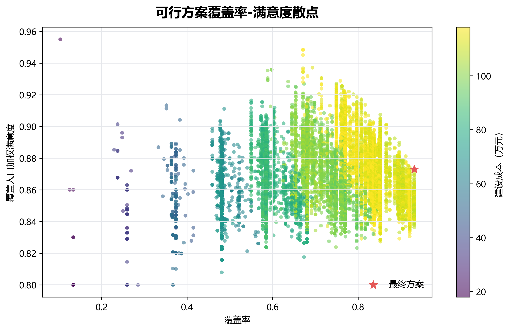

# 第二问：服务站选址与规模优化

## 1 问题重述与建模思路

第二问要求在总建设预算不超过 120 万元、服务半径不超过 1000 米、服务站日容量受规模限制的条件下，确定养老服务站的数量、位置和规模，使第 5 年末老人服务覆盖率和满意度尽可能高。本文沿用第一问得到的第 5 年末老人数量 \(N_{i,5}\) 与消费约束后的月需求 \(Q_{i,s,t,5}\)，将 10 个小区均视为候选站点，建立带容量约束的最大覆盖选址模型。

由于候选点只有 10 个，每个点只有“不建、小型、中型、大型”4 种状态，全部方案数为
\[
4^{10}=1,048,576.
\]
因此本文采用精确枚举而不是启发式搜索。对每个满足预算的站点规模方案，按“容量允许时优先选择综合满意度最高站点”的原则进行固定点分配，并计算覆盖率、满意度、容量、利润等指标，最后按词典序
\[
\max \left(\mathrm{Cov},\overline S,\sum_j \Pi_j\right)
\]
筛选最优方案，即先最大化覆盖率，再最大化覆盖人口加权满意度，若仍并列则选择年度利润更高的方案。

## 2 模型建立

### 2.1 决策变量

设 \(I=\{A,B,C,D,E,F,G,H,I,J\}\) 为小区集合，\(K=\{\text{小型},\text{中型},\text{大型}\}\) 为规模集合。定义
\[
x_{j,k}=
\begin{cases}
1,&\text{在小区 }j\text{ 建设规模 }k\text{ 的服务站},\\
0,&\text{否则},
\end{cases}
\]
以及
\[
u_{i,j}=
\begin{cases}
1,&\text{小区 }i\text{ 分配给站点 }j,\\
0,&\text{否则}.
\end{cases}
\]
每个小区最多建设一个服务站：
\[
\sum_{k\in K}x_{j,k}\le 1,\quad j\in I.
\]

### 2.2 预算、半径与容量约束

设 \(B_k\) 为规模 \(k\) 的一次性建设成本，单位为万元。预算约束为
\[
\sum_{j\in I}\sum_{k\in K}B_kx_{j,k}\le 120.
\]

设 \(d_{ij}\) 为小区 \(i\) 到候选站点 \(j\) 的距离。超出 1000 米不产生有效服务需求，因此有
\[
u_{i,j}=0,\quad d_{ij}>1000,
\]
且小区只能分配给已建站点：
\[
u_{i,j}\le \sum_{k\in K}x_{j,k}.
\]
每个小区最多选择一个站点：
\[
\sum_{j\in I}u_{i,j}\le 1.
\]

第一问给出的消费约束后月需求总人次记为
\[
D_i^m=\sum_{s\in S}\sum_{t\in T}Q_{i,s,t,5},
\]
按每月 30 天折算为日理论需求
\[
D_i^d=\frac{D_i^m}{30}.
\]

### 2.3 满意度与实际有效服务人次

距离满意度 \(S_{1,ij}\) 由附件5的分段规则给出：
\[
S_{1,ij}=
\begin{cases}
1.00,& d_{ij}\le 300,\\
0.90,& 300<d_{ij}\le 500,\\
0.75,& 500<d_{ij}\le 650,\\
0.60,& 650<d_{ij}\le 1000.
\end{cases}
\]

问题2不优化价格，默认按附件2基准价格收费，因此价格满意度取 \(S_3=1\)。设站点 \(j\) 的利用率为
\[
\theta_j=\frac{V_j}{C_{k(j)}},
\]
响应满意度 \(S_{2,j}\) 按附件5规则由 \(\theta_j\) 分段给出。小区 \(i\) 分配到站点 \(j\) 的综合满意度为
\[
S_{ij}=0.2S_{1,ij}+0.3S_{2,j}+0.5S_3.
\]
实际有效服务人次等于理论需求人次乘以满意度：
\[
V_j=\sum_{i\in I}u_{i,j}D_i^dS_{ij}.
\]
容量约束为
\[
V_j\le C_{k(j)}.
\]

由于 \(S_{2,j}\) 依赖利用率，而利用率又依赖分配和满意度，本文对每个站点方案进行固定点迭代：先令所有建成站点 \(S_2=1\)，据此在不突破站点容量的前提下按最高综合满意度准入覆盖小区；再计算实际有效服务人次、利用率和新的 \(S_2\)，重复直到分配和响应满意度稳定。若某小区在所有半径内站点上都会导致容量超限，则该小区暂不计入覆盖。

### 2.4 评价指标与利润核算

服务覆盖率定义为
\[
\mathrm{Cov}=
\frac{\sum_{i\in I}N_{i,5}\mathbf 1(\sum_j u_{i,j}\ge1)}
{\sum_{i\in I}N_{i,5}}.
\]
覆盖人口加权平均满意度定义为
\[
\overline S=
\frac{\sum_{i\in I}N_{i,5}\sum_j u_{i,j}S_{ij}}
{\sum_{i\in I}N_{i,5}\sum_j u_{i,j}}.
\]

设 \(p_s^0\) 为服务 \(s\) 基准价格，\(c_s\) 为直接支出。站点 \(j\) 的年度收入、直接支出和固定成本分别为
\[
R_j=12\sum_{i,s,t}u_{i,j}Q_{i,s,t,5}S_{ij}p_s^0,
\]
\[
G_j=12\sum_{i,s,t}u_{i,j}Q_{i,s,t,5}S_{ij}c_s,
\]
\[
A_j=365F_{k(j)}+\frac{10000B_{k(j)}}{20}.
\]
预计年度利润为
\[
\Pi_j=R_j-G_j-A_j.
\]

## 3 求解算法

精确枚举算法如下。

1. 对 10 个候选小区生成“不建、小型、中型、大型”的全部组合；
2. 删除建设成本超过 120 万元的方案；
3. 对每个预算可行方案，找出每个小区 1000 米内可选站点；
4. 初始化各站点响应满意度 \(S_2=1\)；
5. 按 \(S_{ij}=0.2S_1+0.3S_2+0.5\) 为每个可覆盖小区选择满意度最高且仍有容量余量的站点；
6. 根据分配结果计算各站点理论需求、有效服务人次、利用率和新的响应满意度；
7. 重复第 5-6 步直至分配和响应满意度稳定；
8. 若小区无法在容量约束下分配，则视为未覆盖；对可行分配计算覆盖率、满意度、年度利润；
9. 按 \((\mathrm{Cov},\overline S,\sum_j\Pi_j)\) 的词典序选择最终方案。

若小区数为 \(n\)，固定点迭代次数为 \(L\)，则枚举复杂度为
\[
O(4^n\cdot L\cdot n^2).
\]
本题 \(n=10\)，实际可行方案数为 15207，因此可在普通计算机上直接完成精确搜索。

## 4 求解结果

第 5 年末全街道老人总数为 7579 人，消费约束后全街道月服务需求总人次为 247147 次。最优方案为：D(中型)、G(中型)、J(大型)。

核心指标如下。

| 指标 | 数值 |
| --- | --- |
| 可行方案数 | 15207 |
| 站点数量 | 3 |
| 建设成本（万元） | 109 |
| 服务覆盖率 | 0.931 |
| 覆盖人口加权满意度 | 0.873 |
| 全体老人加权满意度 | 0.813 |
| 年度总利润（元） | 3461832.112 |

### 4.1 站点位置、规模与覆盖关系

| 站点小区 | 规模 | 覆盖小区 | 建设成本_万元 | 日容量_人次 | 日理论需求_人次 | 日有效服务_人次 | 利用率 | 响应满意度 |
| --- | --- | --- | --- | --- | --- | --- | --- | --- |
| D | 中型 | D、H、I | 32 | 2000 | 2168.900 | 1890.791 | 0.945 | 0.600 |
| G | 中型 | C、E | 32 | 2000 | 2119.400 | 1898.982 | 0.949 | 0.720 |
| J | 大型 | A、B、G、J | 45 | 3000 | 3433.300 | 2950.474 | 0.983 | 0.600 |

### 4.2 小区分配与满意度

| 小区 | 第5年老人总数 | 月需求总人次 | 分配站点 | 距离_米 | 距离满意度 | 综合满意度 |
| --- | --- | --- | --- | --- | --- | --- |
| A | 786 | 25937 | J | 500 | 0.900 | 0.860 |
| B | 671 | 21569 | J | 300 | 1 | 0.880 |
| C | 1016 | 34624 | G | 500 | 0.900 | 0.896 |
| D | 601 | 18651 | D | 0 | 1 | 0.880 |
| E | 866 | 28958 | G | 400 | 0.900 | 0.896 |
| F | 521 | 15499 | 未覆盖 |  | 0 | 0 |
| G | 954 | 32123 | J | 600 | 0.750 | 0.830 |
| H | 627 | 19655 | D | 300 | 1 | 0.880 |
| I | 813 | 26761 | D | 500 | 0.900 | 0.860 |
| J | 724 | 23370 | J | 0 | 1 | 0.880 |

### 4.3 年度利润

| 站点小区 | 规模 | 年收入_元 | 年直接支出_元 | 年固定成本_元 | 年度利润_元 |
| --- | --- | --- | --- | --- | --- |
| D | 中型 | 11149600.56 | 9061347.36 | 1184000 | 904253.20 |
| G | 中型 | 11268483.07 | 9162961.92 | 1184000 | 921521.15 |
| J | 大型 | 17449565.64 | 14185007.88 | 1628500 | 1636057.76 |
| 合计 |  | 39867649.27 | 32409317.16 | 3996500 | 3461832.11 |

可行方案的覆盖率-满意度分布如下图所示，红色星标为最终选定方案。

## 5 结果解释

最优方案在 120 万元预算内使用 109 万元，建设 3 个服务站，实现服务覆盖率 93.13%，覆盖人口加权满意度 0.8730。由于容量约束较紧，最优方案选择优先覆盖老人规模大且单位容量收益较高的小区；部分小区即使位于某个服务半径内，若会导致站点容量超限，也不会被计入覆盖。

年度利润核算中，本文采用问题2基准价格口径，尚未引入问题3的政府补贴和自主定价机制。因此该利润仅作为站点方案的辅助评价指标；第三问还需要继续通过补贴与定价优化满足“保本微利、利润率不超过 8%”的政策目标。

## 6 模型局限性与改进方向

模型局限性如下。

1. 将每个小区抽象为一个点，距离矩阵无法反映小区内部楼栋分布、步行路径和道路通达差异；
2. 将服务能力统一折算为总人次，未区分助餐、护理、康复、助浴等服务对人员技能和场地设备的不同要求；
3. 假设老人总是选择综合满意度最高的服务站，忽略习惯、信息不对称、亲友陪同和站点口碑等行为因素；
4. 满意度采用分段常数函数，距离或利用率在阈值附近的小变化会导致评分跳变；
5. 仅以第 5 年末需求作静态规划，没有刻画建设爬坡、年度扩容和短期高峰需求。

改进方向为：在后续研究中可引入道路网络时间距离替代小区间距离，并将容量约束细分为餐位、护理员工时、康复设备、助浴设施等多资源约束；同时可使用 Logit 离散选择模型表示老人选站概率，从“确定性选择最高满意度站点”推广为“多因素概率选择”，使模型更贴近实际运营。
